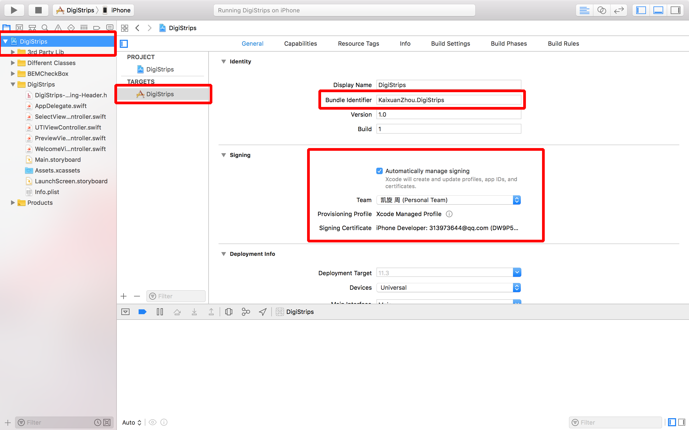

## DigiStrips
DigiStrips App Repo
## Usage
- Clone the repository
- Open the XCodeProject File
- Change the Bundle Identifier to the format: YourName.DigiStrips
- Change the Signing to your own icloud Account
- Image demonstration below: 
- Run the Application
- You will fail
- Go to your iphone's setting -> General -> Device Management -> Trust this device.
- Run the app again on your Xcode
