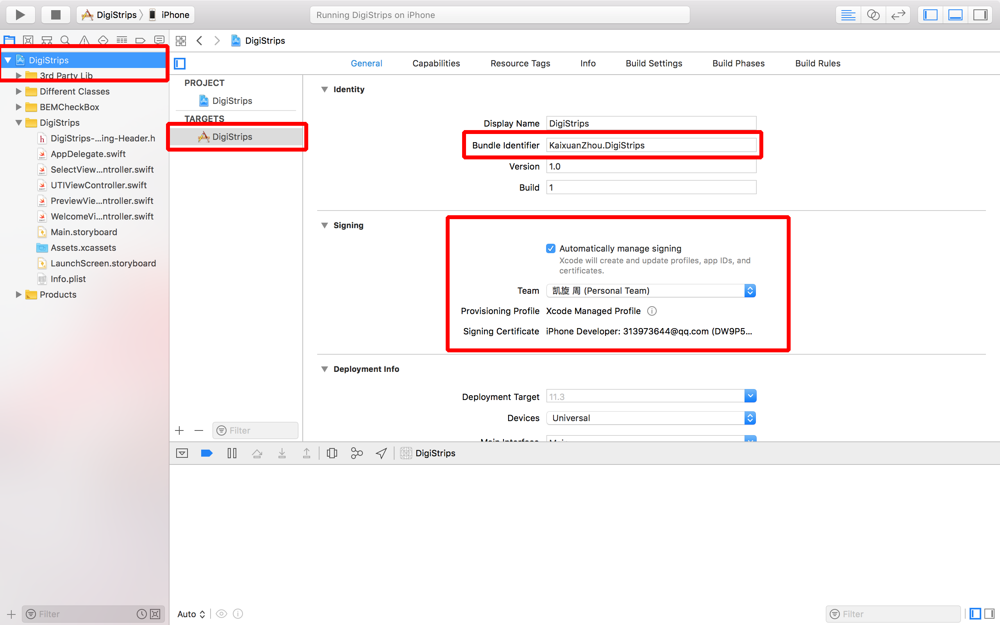
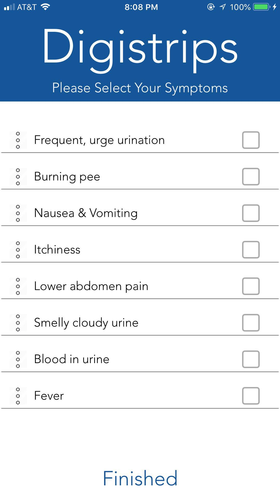
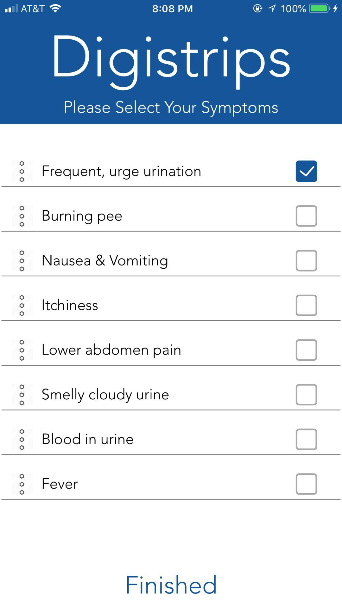
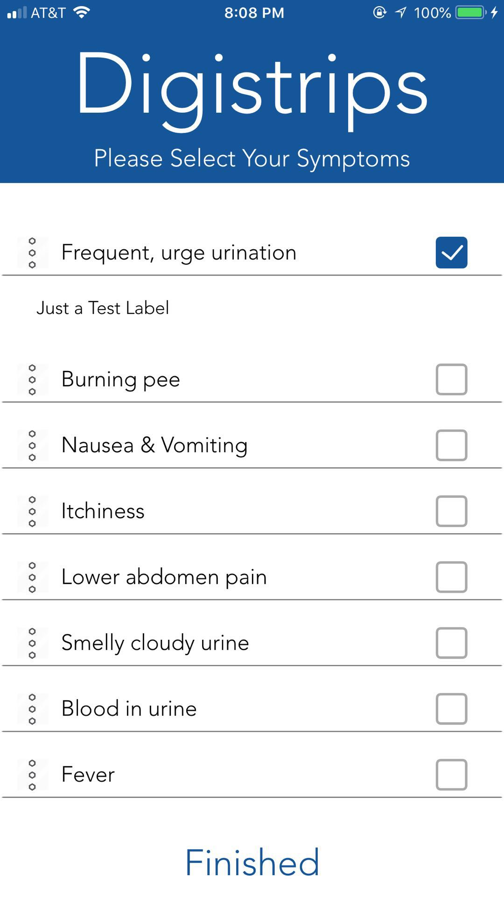
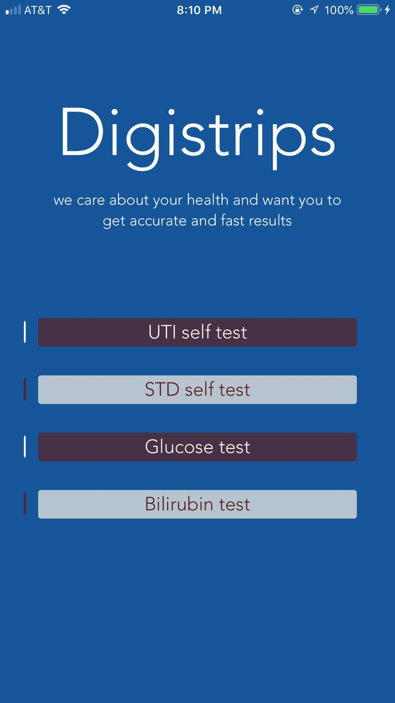
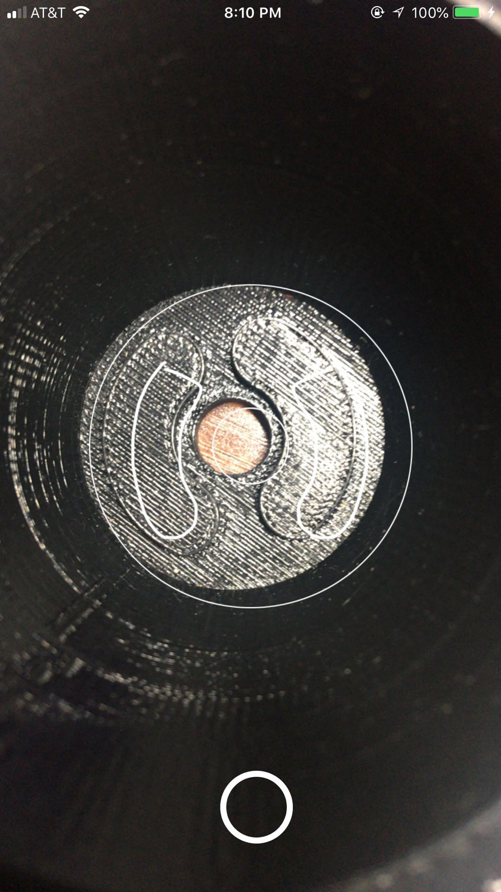
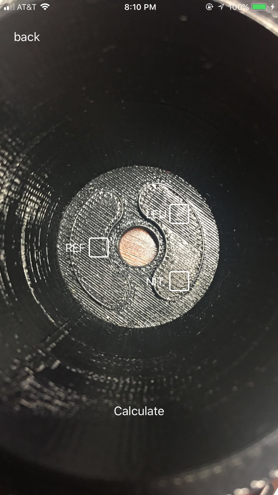
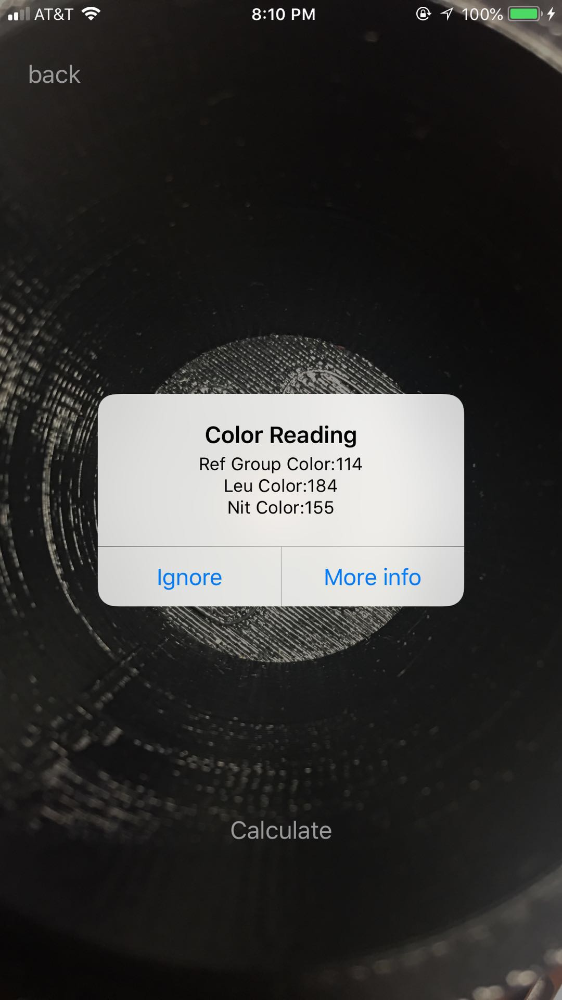

## DigiStrips
DigiStrips App Repo
## Warning
Don't randomly add things to the folder. Otherwise you need to solve conflicts, or reClone the repository to renew the repo
## Usage
- Clone the repository
- Open the XCodeProject File
- Change the Bundle Identifier to the format: YourName.DigiStrips
- Change the Signing to your own icloud Account
- Image demonstration below: 
- 
- Run the Application
- You will fail
- Go to your iphone's setting -> General -> Device Management -> Trust this device.
- Run the app again on your Xcode
## App Pages
- Select Page, User can click the three dots next to the symptom to expand the description for that symptom
-               
- Home Page
- 
- UTI Self Test Page 
- 
- Preview and result
-         
## Needs to be done
- Instruction needs to be more user friendly
- Sizing of the boxes for the bio sensors
- Virtual Prescription
- More elegant UI design
